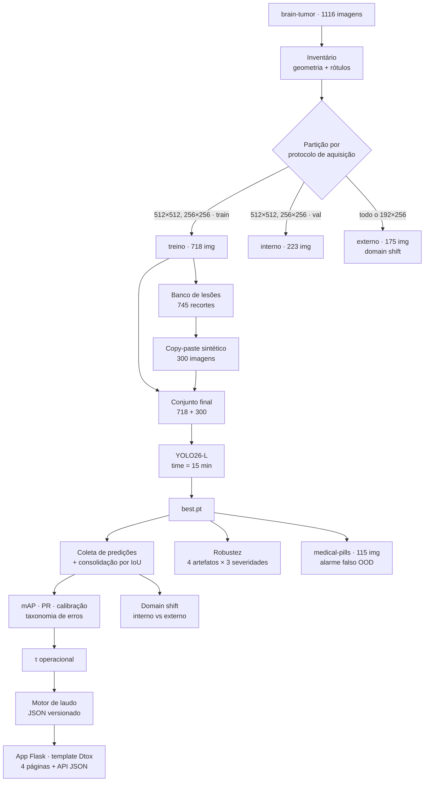

# Detecção e laudo automático de tumor cerebral com YOLO26-L

Pipeline completo de visão computacional: da partição honesta do dataset ao laudo
estruturado em JSON, passando por síntese de dados, diagnóstico quantitativo do modelo
e uma **aplicação web Flask construída sobre o template [Dtox](https://themefisher.com)**.

Todo o projeto — figuras do notebook, relatório técnico e interface — usa a identidade
visual do template: Bootstrap 4, tipografia **Poppins**, azul `#008DEC`, tinta `#091337`
e os gradientes `#17FFD3 → #D3FC71` e `#17FFD3 → #23E3EE`, lidos direto de
`scss/_variables.scss`.

> ⚠️ **Aviso.** Exercício acadêmico. Não é dispositivo médico, não tem validação
> clínica e não deve orientar nenhuma decisão diagnóstica. Os rótulos
> `negative`/`positive` são convenção de anotação de um dataset público, não
> diagnóstico verificado.

---

## O que este projeto tem de diferente

A maioria dos projetos de detecção termina em `mAP@50 = 0.xx`. Este continua a partir dali:

| | |
|---|---|
| **Partição por protocolo** | O conjunto de validação externa não é aleatório: é **todo** o protocolo de aquisição 192×256, que nunca entra no treino. Mede generalização de verdade, não memorização. |
| **Controle negativo OOD** | 115 imagens médicas de outro domínio (`medical-pills`), onde toda detecção é, por construção, invenção. Mede taxa de alarme falso. |
| **Dados sintéticos com rótulo exato** | Lesões recortadas e recoladas com harmonização de intensidade e blending de Poisson — a caixa é conhecida porque a posição foi escolhida, não estimada. |
| **Artefatos de RM simulados** | Ruído Riciano, campo de bias, ghosting N/2 e ringing de Gibbs, derivados do modelo físico e do espaço-k. Usados só para medir robustez, nunca para treinar. |
| **Orçamento de tempo imposto** | O argumento `time=` do Ultralytics sobrescreve `epochs`: o número de épocas vira *saída* do experimento e o relógio fica fixo, qualquer que seja a GPU sorteada pelo Colab. |
| **Diagnóstico além do mAP** | Calibração (ECE), escolha justificada do limiar operacional, taxonomia de erros estilo TIDE, curvas de robustez e comparação entre domínios. |
| **Laudo estruturado** | JSON versionado com 13 campos por achado — área relativa, diâmetro equivalente, lateralidade, contraste, estabilidade sob transformações. |
| **Prestação de contas** | O notebook mede o próprio tempo, exporta `resultados.json` e imprime uma matriz de rastreabilidade requisito → seção → evidência. |
| **Uma só fonte de verdade** | A aplicação web não reimplementa nada: as rotas chamam as mesmas funções `gerar_laudo`, `carregar_cinza` e `mascara_encefalo` do notebook. |

---

## Arquitetura do pipeline



---

## Os dados

### Dataset primário — `brain-tumor` (Ultralytics)

Baixa sem credencial, 4,3 MB, 1116 imagens em escala de cinza com caixas em duas classes.

| partição | imagens | caixas | `negative` | `positive` | protocolo |
|---|---|---|---|---|---|
| treino  | 718 | 752 | 409 | 343 | 512×512, 256×256 e raros |
| interno | 223 | 241 | 154 | 87  | 512×512, 256×256 |
| **externo** | **175** | **173** | **28** | **145** | **192×256, exclusivo** |

*(números conferidos diretamente no dataset, não estimados)*

O achado interessante está na última linha: além da imagem mudar (**deslocamento de
covariável**), a prevalência de classe salta de 46% para 84% de `positive`
(**deslocamento de rótulo**). São dois problemas distintos e cobram preços distintos.

### Segundo conjunto — `medical-pills` (Ultralytics)

115 imagens médicas de outro domínio. Nenhuma contém encéfalo, portanto toda caixa
emitida ali é alarme falso mensurável.

### Dados sintéticos

Copy-paste de lesões com quatro cuidados matemáticos:

1. **Onde colar** — máscara intracraniana por Otsu + maior componente conexo +
   fechamento morfológico, com erosão para afastar da calota.
2. **Como misturar** — máscara elíptica com borda difusa,
   `I = α·I_lesão + (1−α)·I_fundo`.
3. **Harmonização** — casamento dos dois primeiros momentos com a vizinhança do destino.
4. **Alternativa por Poisson** — *seamless cloning* resolvendo `∇²f = ∇²g` com
   continuidade no contorno.

---

## Como executar

1. Abra o notebook no Google Colab.
2. `Ambiente de execução` → `Alterar o tipo de ambiente de execução` → **GPU** (T4 basta).
3. `Ambiente de execução` → `Executar tudo`.

### Perfis

O comportamento inteiro é controlado por um objeto `Config` e por três perfis prontos:

| perfil | modelo | orçamento de treino | total esperado |
|---|---|---|---|
| `rapido` | YOLO26-S | 6 min | ~12 min |
| **`padrao`** | **YOLO26-L** | **15 min** | **≤ 30 min** |
| `completo` | YOLO26-X | 45 min | ~60 min |

Para trocar, edite a célula de configuração da seção 0.1 (`MODO = "padrao"`) ou defina
a variável de ambiente `MODO_PROJETO`.

> **O teto de 30 minutos é imposto, não estimado.** O argumento `time=` do Ultralytics
> encerra o treino ao atingir a duração pedida e devolve o melhor checkpoint. Sem GPU
> o notebook ainda roda, mas o orçamento não é respeitado — e o próprio código avisa.

---

## O que sai do notebook

| arquivo | conteúdo |
|---|---|
| `fig/01…16_*.png` | 16 figuras, todas na paleta do template Dtox |
| `runs/yolo26_<perfil>/weights/best.pt` | pesos treinados |
| `laudo_exemplo.json` | laudo estruturado de uma imagem |
| `laudos_lote.csv` | tabela de laudos, ordenável por carga lesional |
| `rastreabilidade.csv` | matriz requisito → seção → evidência |
| `resultados.json` | **todas** as métricas da execução — fonte única para o relatório e para as páginas `/resultados` |
| `neuro26/` | a aplicação web escrita pela seção 8 |

### Esquema do laudo

```json
{
  "versao_laudo": "1.0",
  "arquivo": "val_1 (101).jpg",
  "imagem": { "largura_px": 512, "altura_px": 512,
              "area_intracraniana_px2": 33045, "linha_media_estimada_px": 265.1 },
  "parametros": { "limiar_confianca": 0.25, "imgsz": 640,
                  "iou_consolidacao": 0.55, "teste_consistencia": true,
                  "escala_mm_por_px": null },
  "resumo": { "n_achados": 1, "veredito": "achado detectável",
              "confianca_maxima": 0.83, "carga_lesional_px2": 1652.0,
              "carga_lesional_pct_encefalo": 5.0,
              "classes_detectadas": ["positive"] },
  "achados": [{
     "id": "L01", "achado": "positive", "confianca": 0.83,
     "caixa_px": [311.7, 186.1, 354.7, 224.5], "centro_px": [333.2, 205.3],
     "area_px2": 1652.0, "area_relativa_encefalo_pct": 5.0,
     "diametro_equivalente_px": 45.9, "razao_aspecto": 1.12,
     "lateralidade_imagem": "direita da imagem",
     "deslocamento_da_linha_media_px": 68.1,
     "intensidade_media": 148.3, "contraste_relativo": 1.306,
     "estabilidade_iou": 0.87
  }],
  "aviso": "…"
}
```

---

## Interface web

Aplicação **Flask** cujo front-end é o template **Dtox** (Bootstrap 4 + Poppins),
com quatro páginas e uma API:

| rota | o que faz |
|---|---|
| `/` | apresenta o pipeline, as partições e a síntese, com as figuras da execução |
| `/laudo` | envia uma imagem, ajusta o limiar τ e devolve o laudo completo + JSON |
| `/resultados` | lê o `resultados.json` da execução e monta o painel de diagnóstico |
| `/metodo` | método, decisões de treino, eixos de avaliação e limitações |
| `/api/laudo` | o mesmo motor em JSON, para integrar com outro sistema |

### Rodar localmente

```bash
cd webapp
pip install -r requirements.txt
python app.py --pesos ../runs/yolo26_padrao/weights/best.pt \
              --dados ../particionado \
              --resultados ../resultados.json
# http://127.0.0.1:5000
```

### Rodar no Colab

A seção 8 do notebook escreve a aplicação em `neuro26/`, sobe o Flask numa thread e
devolve o endereço com `google.colab.kernel.proxyPort` — nativo, sem token de serviço.

**Dois modos, detectados automaticamente.** Com o pacote completo do Dtox presente em
`webapp/static/dtox/`, a aplicação usa o template inteiro: imagens de fundo, formas
decorativas, AOS, slick e venobox. Sem ele, usa um subconjunto do próprio `style.css`
e do `bootstrap.min.css` que acompanham o template — mesmo layout, sem dependência
externa. O modo ativo é informado na inicialização.

### Estrutura da aplicação

```
webapp/
├── app.py                 rotas Flask, conteúdo editorial e painel de resultados
├── requirements.txt
├── pipeline/              os mesmos módulos do notebook (dados, síntese, avaliação, laudo)
├── templates/             base · index · laudo · resultados · metodo  (Jinja2 sobre o Dtox)
└── static/
    ├── dtox/              o template original: css, js, plugins, images
    └── projeto/           projeto.css e projeto.js — extensões escritas sobre as
                           variáveis do template, mais as figuras da execução
```

---

## Fatos verificados durante a construção

Registrados aqui porque mudam o código de quem for reproduzir:

- `yolo26l.pt` existe e é resolvido pelo Ultralytics (26,3 M de parâmetros, tarefa
  `detect`) — verificado por download e carga.
- A aplicação Flask foi executada e testada nos dois modos (template completo e
  enxuto): as quatro páginas respondem 200 e o fluxo de laudo produz o JSON e a
  imagem anotada.
- O argumento `time=` **realmente sobrescreve** `epochs`: com `epochs=2, time=0.05`
  o treinador reprogramou a execução para 55 épocas.
- **`augment=True` não é suportado** pela cabeça end-to-end do YOLO26; o Ultralytics
  emite `Model does not support 'augment=True'` e volta para escala única. Por isso a
  incerteza é estimada por consistência sob espelhamento e multiescala.
- `brain-tumor.zip` e `medical-pills.zip` baixam sem credencial dos *releases* do
  repositório `ultralytics/assets`.
- O notebook foi executado de ponta a ponta, sem erro, no perfil de verificação.

## O que o projeto não prova

1. Não é diagnóstico — as classes são convenção de dataset, não laudo clínico.
2. A partição externa é um *proxy* de fonte. Geometria sugere aparelho diferente, não prova.
3. Os dados sintéticos herdam o viés do original: aumentam variedade de posição e
   escala, não criam patologia nova.
4. Os artefatos são simulados a partir do modelo físico, não medidos em scanner real.
5. A estabilidade é concordância entre vistas, **não** probabilidade calibrada.
6. Com 15 minutos de treino, as métricas podem ainda estar subindo — o número reportado
   é um piso, não um teto.
7. Sem `PixelSpacing` do DICOM não há medida em milímetros. O campo existe e fica vazio.

---

## Licença e créditos

- **Ultralytics** e os conjuntos `brain-tumor` e `medical-pills`: **AGPL-3.0**.
  Trabalhos derivados disponibilizados como serviço herdam essa obrigação.
- **Dtox**, template HTML da [Themefisher](https://themefisher.com), usado como base da
  identidade visual e da interface. A licença original acompanha o pacote em
  `webapp/static/dtox/license`.
- **Bootstrap** (MIT) e **Poppins** (SIL OFL), ambos distribuídos junto ao template.

Vale conferir todas antes de qualquer uso além do acadêmico.

**Referências**

- Redmon, J. et al. *You Only Look Once: Unified, Real-Time Object Detection*. arXiv:1506.02640
- Ultralytics. *YOLO26 — Unified Real-Time End-to-End Vision Models*. `docs.ultralytics.com/models/yolo26`
- Ultralytics. *Brain Tumor Dataset* · *Train Mode*. `docs.ultralytics.com`
- Bolya, D. et al. *TIDE: A General Toolbox for Identifying Object Detection Errors*. ECCV 2020
- Guo, C. et al. *On Calibration of Modern Neural Networks*. ICML 2017
- Pérez, P. et al. *Poisson Image Editing*. SIGGRAPH 2003
- Gudbjartsson, H.; Patz, S. *The Rician Distribution of Noisy MRI Data*. MRM, 1995
